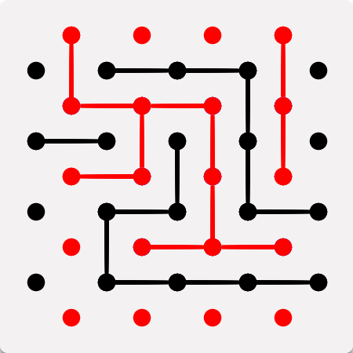

# Bridg-it
My implementation of the game Bridg-it in javascript, html and css. Link to play the game https://gabriel-candeia.github.io/Bridg-it/.

## Result 

## Objective
In the game Bridg-it the first player can always win by following a certain strategy. I wanted to implement a bot that executes this strategy. 

## To-do list
  * Restructure the project in a more object-oriented way using Typescript.
  * Make a decent readme, explaining the algorithm behind the bot.
